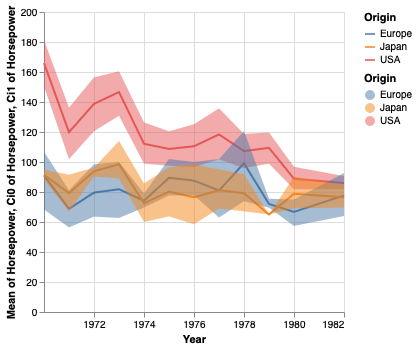

# Lab 2
[PDF](/VI/lab2/DataVisualizationAltair5_IV2023_2024.pdf) with exercises done in the [notebook](/VI/lab2/exercises_pdf.ipynb). _Altair_ documentation & plot practice.

## Example
Using the _cars_ dataset in _Vega Datasets_, create a line chart with the average horsepower per year, with confidence intervals, separated per origin.

  

